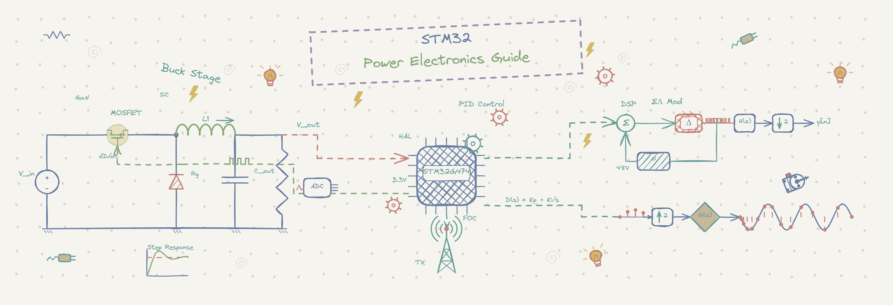

# SPARK: Simulink & STM32 Power Electronics Application Resource Kit


### NUCLEO-G474RE-PowerElectronics-Guide

---



A comprehensive guide to getting started with the **STM32 NUCLEO-G474RE** development board for power electronics applications. This repository provides tutorials, examples, and best practices for developing power electronics projects using **STM32CubeIDE** and **MATLAB Embedded Coder**.

## 📋 Table of Contents

- [Overview](#overview)
- [Features](#features)
- [Prerequisites](#prerequisites)
- [Hardware Requirements](#hardware-requirements)
- [Recommended Test Equipment](#recommended-test-equipment--components)
- [Software Requirements](#software-requirements)
- [Getting Started](#getting-started)
- [Project Structure](#project-structure)
- [Examples](#examples)
- [Documentation](#documentation)
- [Contributing](#contributing)
- [License](#license)
- [Support](#support)

## 🎯 Overview

This guide is designed for engineers and developers who want to learn how to build power electronics applications on the STM32 NUCLEO-G474RE board. Whether you're working with motor control, DC-DC converters, inverters, or other power electronics applications, you'll find practical examples and comprehensive tutorials.

The NUCLEO-G474RE is particularly suited for power electronics due to its:
- Advanced PWM capabilities (multiple timers with complementary outputs)
- High-resolution ADC for sensing and feedback
- Floating-point math co-processor (FPU)
- Sufficient computational power for real-time control algorithms

## ✨ Features

- **STM32CubeIDE Projects**: Complete, ready-to-use project templates
- **MATLAB Integration**: Selected examples with MATLAB Embedded Coder support
- **Power Electronics Focus**: PWM generation, ADC sampling, feedback control, protection mechanisms
- **Step-by-Step Tutorials**: Beginner-friendly guides with detailed explanations
- **Real-World Examples**: Practical implementations of common power electronics circuits
- **Best Practices**: Firmware development guidelines for power electronics applications
- **Documentation**: Comprehensive comments and external documentation

## 📦 Prerequisites

### Knowledge
- Basic understanding of embedded C programming
- Familiarity with STM32 microcontroller concepts
- Introductory power electronics knowledge (PWM, ADC, feedback control)
- (Optional) MATLAB/Simulink experience for MATLAB Embedded Coder examples

### Hardware
- STM32 NUCLEO-G474RE development board
- USB cable for programming and debugging
- ST-Link programmer (built-in on NUCLEO board)
- FTDI Breakout board.
<!-- - External power supply (optional, for high-power testing) -->

### Software
- STM32CubeIDE (version 1.10 or later)
- STM32CubeMX (typically included with CubeIDE)
- MATLAB R2021b or later with Embedded Coder toolbox

## 🔧 Hardware Requirements

| Component | Specification |
|-----------|---------------|
| **Microcontroller** | STM32G474RE |
| **Flash Memory** | 512 KB |
| **RAM** | 160 KB |
| **Operating Voltage** | 2.0V - 3.6V |
| **ADC Resolution** | 12-bit |
| **Timer Channels** | Multiple advanced timers with complementary outputs |
| **Debug Interface** | ST-Link V2-1 (on-board) |

## 🛠️ Recommended Test Equipment & Components

To build, test, and debug the examples in this guide (especially the high-frequency switching and closed-loop control projects), the following test equipment, breakout boards, and discrete components are highly recommended:

### 1. Oscilloscope & Software
An oscilloscope is essential for verifying high-frequency PWM duty cycles, complementary switching, dead-time, and filtering noise.
* **Hardware:** [Hantek 6022BL USB Oscilloscope](http://www.hantek.com/) (or similar 2-channel oscilloscope).
* **Software:** [OpenHantek6022](https://github.com/OpenHantek/OpenHantek6022) — Open-source software that is highly recommended and offers much better performance and usability than the default Hantek software.

### 2. Logic Analyzer (Budget Alternative)
If a physical oscilloscope is not available, a USB logic analyzer is a quick and cost-effective fix to capture digital states. While it cannot measure analog signals or voltage noise like an oscilloscope, it is excellent for timing and protocol debugging.
* **Premium Option:** [Saleae Logic](https://www.saleae.com/logic) (Professional, extremely clean software interface, but expensive).
* **Budget Options:**
  - [Robu USB Logic Analyzer 24M 8CH](https://robu.in/product/usb-logic-analyze-24m-8ch-mcu-arm-fpga-dsp-debug-tool/)
  - [Quartz Components USB Logic Analyzer 24M 8CH](https://quartzcomponents.com/products/usb-logic-analyze-24m-8ch-mcu-arm-fpga-dsp-debug-tool)
  - [DigiKey Specialty Logic Analyzers & Test Equipment](https://www.digikey.com/en/products/filter/specialty-equipment/618?s=N4IgjCBcoLQExVAYygFwE4FcCmAaEA9lANogCsI%2BAnCALoC%2B9%2BCkpANgQOYCWSABAEMAdgLYBPAM7Z0dekA)
* **Decoder Software:**
  - [Saleae Logic Software](https://www.saleae.com/downloads)
  - [Sigrok PulseView](https://sigrok.org/wiki/PulseView) (Open-source logic analysis software)

### 3. USB-to-UART (FTDI) Breakout Boards
To transmit logging data and telemetry from the NUCLEO board to a PC. Ensure your chosen serial adapter supports **at least 3 MBaud** for high-speed logging. It doesn't strictly need to use an official FTDI chip. For FTDI-based chips, the **FT232RL** is the most widely available and cost-effective module supporting up to 3 MBaud.

> [!CAUTION]
> Before connecting any USB-to-UART breakout board to your active power stage, please review the safety precautions in the [FTDI Breakout Board Safety Guidelines](./Debugging_Tips.md#ftdi-breakout-board-safety-guidelines) to prevent ground loops that could destroy your PC or hardware.

* **Recommended Listings:**
  - [Quartz Components FT232RL USB to TTL Module](https://quartzcomponents.com/products/ft232rl-usb-to-ttl-3-3v-5-5v-serial-adapter-module) (Budget-friendly)
  - [SparkFun FTDI Basic Breakout (3.3V)](https://www.sparkfun.com/sparkfun-ftdi-basic-breakout-3-3v.html) (Standard development breakout)
  - [Adafruit FT232H Breakout Module](https://www.adafruit.com/product/2264) (Premium high-speed FT232H series, much nicer)
  - [DigiKey USB Serial Adapters/Converters](https://www.digikey.com/en/products/filter/adapters-converters/882?s=N4IgjCBcoLQExVAYygFwE4FcCmAaEA9lANogCsI%2BAnCALoC%2B9%2BCkpAqgM4BGABKgTzYBBAEoAVOvSA) & [USB Modules](https://www.digikey.com/en/products/filter/modules/778?s=N4IgjCBcoLQExVAYygFwE4FcCmAaEA9lANogCsI%2BAnCALoC%2B9%2BCkpAqgM4BGABKgTzYBBAEoAVOvSA) (Alternative interface modules and converters)

### 4. Prototyping & Discrete Components
For breadboarding the example hardware setups:
* Dupont jumper wires (Male-to-Male and Male-to-Female).
* Tactile push buttons (for controls like start/stop/direction).
* External LEDs with matching current-limiting resistors (e.g., 220Ω, 330Ω).
* Pull-up / pull-down resistors (e.g., 4.7kΩ, 10kΩ) for digital state definition.

## 💻 Software Requirements

| Tool | Version | Purpose |
|------|---------|---------|
| **STM32CubeIDE** | 1.10+ | Development environment and debugging |
| **STM32CubeMX** | Included | Pin and peripheral configuration |
| **ARM GCC Compiler** | Included | C/C++ compilation |
| **MATLAB Embedded Coder** | R2021b+ | (Optional) Code generation from Simulink |

## 🚀 Getting Started

### Step 1: Clone the Repository

```bash
git clone https://github.com/Anmol-G-K/NUCLEO-G474RE-PowerElectronics-Guide.git
cd NUCLEO-G474RE-PowerElectronics-Guide
```

### Step 2: Install STM32CubeIDE

1. Download from [STMicroelectronics official website](https://www.st.com/en/development-tools/stm32cubeide.html)
2. Install following the official documentation
3. Ensure ST-Link drivers are installed

### Step 3: Open Your First Project

1. Launch STM32CubeIDE
2. Go to `File` → `Open Projects from File System`
3. Navigate to the `Examples/01_Basic_Led_Blink` folder
4. Select the project and click `Finish`

### Step 4: Build and Flash

1. Right-click on the project → `Build Project`
2. Connect the NUCLEO board via USB
3. Right-click on the project → `Run As` → `STM32 C/C++ Application`
4. Verify the LED blinks on the board

### Step 5: (Optional) MATLAB Setup

For examples using MATLAB Embedded Coder:

1. Install MATLAB with Embedded Coder toolbox
2. Configure MATLAB to use the ARM GCC compiler
3. Navigate to MATLAB examples in the specific folder
4. Follow the specific tutorial documentation

## 📁 Project Structure

```
NUCLEO-G474RE-PowerElectronics-Guide/
│
├── Assets/                              # Project assets (e.g., banner image)
│   └── power_electronics_guide.png
│
├── Examples/                            # Hands-on power electronics examples
│   ├── 01_Basic_Led_Blink/              # Simple GPIO and user LED control (C & Simulink)
│   ├── 02_ADC_Basic/                    # Analog-to-digital conversion & sampling
│   ├── 03_PWM_Generation/               # High-resolution PWM generation & dead-time insertion
│   ├── 04_Timer_Basics/                 # Timer-driven interrupt service routines (ISRs)
│   ├── 05_H_Bridge_Control/             # Bidirectional H-bridge control using complementary PWM
│   ├── 06_Buck_Converter_Closed_Loop/   # Closed-loop Buck converter voltage control
│
├── CONTRIBUTING.md                      # Contribution guidelines
├── Debugging_Tips.md                    # Troubleshooting and debugging tips
├── LICENSE                              # MIT License
└── README.md                            # Main project documentation
```

<!-- │   └── 07_Phase_Shifted_PWM/            # Phase-shifted PWM switching technique -->

## 📚 Examples

### 1. Basic LED Blink
**Location**: `Examples/01_Basic_Led_Blink`

Get familiar with the development environment by blinking the user LED on the board. This example introduces basic GPIO configuration, pin mapping, and the repository's C/MATLAB workflow.

### 2. ADC Sampling
**Location**: `Examples/02_ADC_Basic`

Read analog values from a potentiometer or sensor using the microcontroller's ADC. It explains sampling, trigger modes, and data resolution, which are essential for feedback loops in power electronics.

### 3. PWM Generation
**Location**: `Examples/03_PWM_Generation`

Configure PWM signals to drive power semiconductors (MOSFETs or IGBTs). This example demonstrates how to set switching frequency, adjust duty cycle, configure complementary channels, and safely insert dead-time.

### 4. Timer Basics and ISR
**Location**: `Examples/04_Timer_Basics`

Implements an event-driven system utilizing timer interrupts and external GPIO interrupts on the NUCLEO board. Demonstrates how to write ISRs to toggle states and cycle through LED blinking speeds dynamically.

### 5. H-Bridge Motor Control
**Location**: `Examples/05_H_Bridge_Control`

Implements a bidirectional H-bridge driver using the High-Resolution Timer (HRTIM) to generate 40 kHz complementary PWM signals with 1 μs dead-time. Features active ADC duty modulation, a soft-stop ramp, and a state machine for direction control.

### 6. Closed-Loop Buck Converter
**Location**: `Examples/06_Buck_Converter_Closed_Loop`

Implements closed-loop voltage control of a synchronous Buck converter. It showcases how to design control algorithms in MATLAB Simulink and use Embedded Coder to automatically generate high-performance C code for real-time control on the STM32G474.

<!-- ### 7. Phase-Shifted PWM
**Location**: `Examples/07_Phase_Shifted_PWM`

Implements a phase-shifted PWM technique using advanced timer configurations. This control strategy is widely used in full-bridge converters to achieve zero-voltage switching (ZVS) by shifting the phase between complementary output legs. -->

## 📖 Documentation

Comprehensive documentation guides and templates are available in the repository:

- **[Debugging Tips](./Debugging_Tips.md)** - Troubleshooting and debugging techniques for STM32 and Simulink.
- **[Documentation Guide](./Documentation/Documentation_Guide.md)** - Guidelines on writing project documentation using LaTeX, drawing tools, and compilation options.

## 🤝 Contributing

Contributions are welcome! Whether it's adding new examples, improving documentation, or reporting bugs:

1. Fork the repository
2. Create a feature branch (`git checkout -b feature/YourFeatureName`)
3. Commit your changes (`git commit -m 'Add your feature'`)
4. Push to the branch (`git push origin feature/YourFeatureName`)
5. Open a Pull Request

Please ensure your contributions:
- Follow the existing code style and structure
- Include meaningful comments in the code
- Add documentation for new examples
- Test thoroughly on actual hardware

See [CONTRIBUTING.md](./CONTRIBUTING.md) for more details.

## 📄 License

This project is licensed under the **MIT License** - see the [LICENSE](./LICENSE) file for details.

This allows for both commercial and personal use with proper attribution.

## 🆘 Support

### Resources
- STM32:
  - [STMicroelectronics Official Documentation](https://www.st.com/en/microcontrollers/stm32g4-series.html)
  - [STM32 Nucleo-64 development board](https://www.st.com/en/evaluation-tools/nucleo-g474re.html)
  - [STM32G474RE](https://www.st.com/en/microcontrollers-microprocessors/stm32g474re.html)
  - [STM32CubeIDE User Manual](https://www.st.com/resource/en/user_manual/dm00629855-stm32cubeide-integrated-development-environment-user-manual-stmicroelectronics.pdf)
- Matlab:
  - [Embedded Coder](https://in.mathworks.com/products/embedded-coder.html)
  - [Embedded Coder Support Package for STMicroelectronics STM32 Processors](https://in.mathworks.com/matlabcentral/fileexchange/43093-embedded-coder-support-package-for-stmicroelectronics-stm32-processors)

### Getting Help
- **Issues**: Check existing [GitHub Issues](../../issues) or create a new one
- **Discussions**: Use GitHub Discussions for questions and knowledge sharing

### Troubleshooting
- **Compilation Errors**: Check [Debugging Tips](./Debugging_Tips.md)
- **Hardware Issues**: Verify connections and power supply
- **STM32CubeIDE Problems**: Update to the latest version

### Tutorials
- [Get Started with Embedded Coder](https://in.mathworks.com/help/ecoder/product-fundamentals.html)
- [Embedded Coder Documentation](https://in.mathworks.com/help/ecoder/index.html)
- [Getting Started with STMicroelectronics STM32 Processor Based Boards](https://in.mathworks.com/help/ecoder/stmicroelectronicsstm32f4discovery/ug/Getting-started-stm32cubemx.html)
- [STMicroelectronics STM32 Documentation](https://in.mathworks.com/help/ecoder/stm32-spkg.html)

### Reference Manuals:
- [STM32 G474RE User Manual](https://www.st.com/resource/en/user_manual/um2505-stm32g4-nucleo64-boards-mb1367-stmicroelectronics.pdf)
- [STM32G474xE Datasheet](https://www.st.com/resource/en/datasheet/stm32g474re.pdf)
- [STM32 G474RE Reference Manual](https://www.st.com/resource/en/reference_manual/rm0440-stm32g4-series-advanced-armbased-32bit-mcus-stmicroelectronics.pdf)
- [Application note - HRTIM Cookbook](https://www.st.com/resource/en/application_note/an4539-hrtim-cookbook-stmicroelectronics.pdf)
- [ Description of STM32G4 HAL and low-layer drivers](https://www.st.com/resource/en/user_manual/um2570-description-of-stm32g4-hal-and-lowlayer-drivers--stmicroelectronics.pdf)

<!-- ## 🗺️ Roadmap

Planned additions:
- [ ] Three-phase inverter control example
- [ ] Advanced PWM dead-time management
- [ ] Real-time data logging example
- [ ] More MATLAB Embedded Coder examples
- [ ] FreeRTOS integration example
- [ ] CAN bus communication tutorial -->
---
<!-- - [ ] As of now ert_rtw is also tracked will untrack in future if required. -->

## 📝 Citation

If you use this guide in your projects or research, please cite:

```
SPARK: Simulink & STM32 Power Electronics Application Resource Kit (formerly NUCLEO-G474RE-PowerElectronics-Guide)
https://github.com/Anmol-G-K/NUCLEO-G474RE-PowerElectronics-Guide
```

## 👨‍💻 Author

**Anmol Govindarajapuram Krishnan**
- GitHub: [@Anmol-G-K](https://github.com/Anmol-G-K)
- Email: cb.en.u4eee23103@cb.students.amrita.edu

## 🙏 Acknowledgments

- STMicroelectronics for excellent microcontrollers and tools
- The embedded systems and power electronics community
- Contributors and users who provide feedback

---


For the latest updates and announcements, watch this repository! ⭐